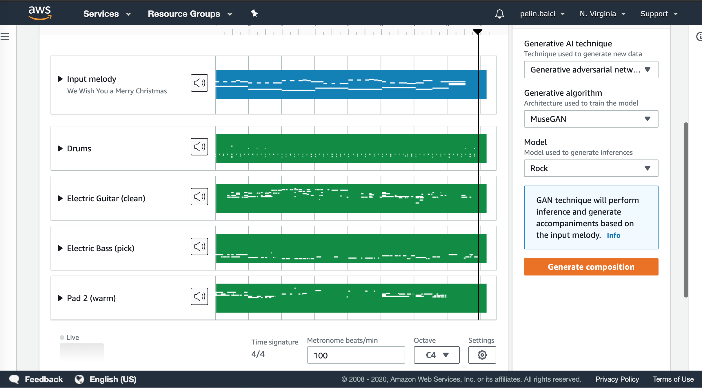

# Why machine learning on AWS?

Ref: https://classroom.udacity.com/courses/ud090/lessons/099925a2-4f01-41c7-a4d4-8ce246f7b801/concepts/f8cb43fe-de2a-4948-837c-0a2001566ca4

### AWS Mission
Put machine learning in the hands of every developer.

### Why AWS?
- AWS offers the broadest and deepest set of AI and ML services with unmatched flexibility.
- You can accelerate your adoption of machine learning with AWS SageMaker. Models that previously took months and 
required specialized expertise can now be built in weeks or even days.
- AWS offers the most comprehensive cloud offering optimized for machine learning.
- More machine learning happens at AWS than anywhere else.

### More Relevant Enterprise Search With Amazon Kendra
- Natural language search with contextual search results
- ML-optimized index to find more precise answers
- 20+ Native Connectors to simplify and accelerate integration
- Simple API to integrate search and easily develop search applications
- Incremental learning through feedback to deliver up-to-date relevant answers

### Online Fraud Detection with Amazon Fraud Detector
- Pre-built fraud detection model templates
- Automatic creation of custom fraud detection models
- One interface to review past evaluations and detection logic
- Models learn from past attempts to defraud Amazon
- Amazon SageMaker integration

### Better Insights And Customer Service With Contact Lens
- Identify common call types
- Identify recurring themes based on customer call feedback
- Alert supervisors when customers are having a poor experience
- Assist agents with a knowledge base to answer questions as they are being asked

### How to Get Started?
- AWS DeepLens: deep learning and computer vision
- AWS DeepRacer and the AWS DeepRacer League: reinforcement learning
- AWS DeepComposer: Generative AI.
- AWS ML Training and Certification: Curriculum used to train Amazon developers
- Partnerships with Online Learning Providers: Including this course and the Udacity AWS DeepRacer course!

### How can Amazon Sagemaker accelerate adoption of ml?
It enables developer to quickly build machine learning. 

### Examples for Tools and Categories

AI Service:
- Amazon Personalize
- Amazon Recognition Image
- Amazon Translate
- Amazon Fraud Detector
- Amazon CodeGuru
- Amazon Kendre
- Amazon Forecast
- Amazon Lex (Chatbot)

ML Service:
- Amazon SageMaker
- SageMaker Groundtruth
- Augmented AI
- NEO

ML Framework:
- Tensorflow
- PyTorch
- mxnet

ML Interface
- Keras
- Gluon
- DeepGraphLibrary

Infrastructure
- Elastic Container Service
- Elastic Kubernetes Service
- Elastic Inference

# What is AWS Deep Composer?

It gives developers a creative way to get started with machine learning. The device is
a 32 key, 2 octave keyboard.  

You don't need any musical talent to get started:)

You can train and optimize generative AI models to create original music.

It uses Generative Adversial Networks --> GANs. Pits two netwprks against eachother to generate new creative content. 

**************
Ref: https://classroom.udacity.com/courses/ud090/lessons/099925a2-4f01-41c7-a4d4-8ce246f7b801/concepts/c320df67-0567-427d-a8d5-30a6433d6696
AWS Deep Composer uses Generative AI, or specifically Generative Adversarial Networks (GANs), to generate music.
GANs pit 2 networks, a generator and a discriminator, against each other to generate new content.

The best way we’ve found to explain this is to use the metaphor of an orchestra and conductor. 

In this context, the generator is like the orchestra and the discriminator is like the conductor:

- The orchestra plays and generates the music. 
- The conductor judges the music created by the orchestra and coaches the orchestra to improve for future iterations. 

So an orchestra, trains, practices, and tries to generate music, and then the conductor coaches them to produced more 
polished music.

### AWS DeepComposer Workflow
Use the AWS DeepComposer keyboard or play the virtual keyboard in the AWS DeepComposer console to input a melody.

Use a model in the AWS DeepComposer console to generate an original musical composition. 

You can choose from jazz, rock, pop, symphony or Jonathan Coulton pre-trained models or you can also build your 
own custom genre model in Amazon SageMaker.

Publish your tracks to SoundCloud or export MIDI files to your favorite Digital Audio Workstation (like Garage Band) 
and get even more creative.

**************

Genres: Jazz, Rock, Pop, Symphony. No blues, no country western.

Discriminator: 
- Evaluates the quality of output
- Providing feedback

Generator:
- Creating new output

# AWS DeepComposer

Ref: https://d32g4xocucupjo.cloudfront.net/#types-of-ml/ml-landscape

Machine learning (ML), a subset of artificial intelligence (AI), can help you make better business decisions.
Machine learning is a process where machines break down data, learn from it, and then generate a result. 

You can use these results:
- to drive key business decisions (supervised learning), 
- segment customers (unsupervised learning), 
- or place advertisements (reinforcement learning).

### RL:
A reinforcement learning (RL) model learns from experience and over time it can identify which actions lead to the 
best rewards.

💛  Reinforcement learning is characterized by a continuous loop where an agent interacts with an environment and measures 
the consequences of its actions.

### Supervised Learning:
Supervised learning is a technique used to generate a prediction or classification. 

The goal is to take input data and output data, and then train an algorithm on how to connect the dots between the two variables.

💛  A classification model will learn to identify how input variables contribute to the categorization of data points.
### Unsupervised Learning: 

We use unsupervised learning to better understand the distribution of the input data.

We're looking to connect the dots between the input variables. Later we can use this information to develop a supervised learning based algorithm.

💛 A clustering model attempts to find groups, similarities, and relationships within unlabelled data.

**The generative AI techniques used in AWS DeepComposer understand the underlying pattern distribution in music to generate new music.**

### What is Generative AI?
Ref: https://d32g4xocucupjo.cloudfront.net/#generative-music/examples

Generative AI opens the door to a world of possibilities for human and computer creativity. There are practical 
applications emerging across industries — from turning sketches into images for accelerated product development, 
to improving computer-aided design of complex objects.

Generative AI enables computers to learn the underlying pattern of a given problem and use this knowledge to generate 
new content from input (such as images, music, and text).

### Types of Generative AI in AWS DeepCpomposer:
There are two types of Generative AI networks in AWS deepComposer: U-Net and MuseGAN.

💛 The U-Net architecture
 
It was originally created for generating images. The network transforms music into an image-like 
representation before interpreting it.  Modern GAN-based models instead treat music as a series of images, 
and can therefore leverage existing techniques within the computer vision domain.

In AWS DeepComposer, we represent music as a two-dimensional matrix (also referred to as a piano roll) with “time” on 
the horizontal axis and “pitch” on the vertical axis. 

You might notice this representation looks similar to an image. A one or zero in any particular cell in this grid 
indicates if a note was played or not at that time for that pitch.

U-Net Architecture: Input --> Encoder --> Latent Space --> Decoder --> Output

💛 The MuseGAN architecture
 
It was built specifically for generating music and has components for each instrument as well as 
the overall song. It's able to capture the unique characteristics of each instrument, and how they harmonize with each other 
to generate the overall song.

### Generative AI Algorithms:

1. GANS : Generative Adversarial Network  --> U-NET, MuseGAN
2. VAEs: Variational Autoencoders
3. AR: Autoregressive

### GANS

💛 Two neural networks compete:

- Generator
- Discriminator

### Generator

(unsupervised learning)

It is a convolutional neural network (CNN) network that is trained to produce 
realistic-seeming output. It produces content samples based on random inputs.

The generator network used in AWS DeepComposer is adapted from the U-Net architecture. It consists of encoder and decoder. 

What are encoder decoder and latent space?

- “encoder” that maps the single track music data (represented as piano roll images) to a relatively lower dimensional “latent space“.
- ”decoder“ that maps the latent space back to multi-track music data.

Single melody and noise vector is provided to generator. 

💛 Noise is important since without noise the same input generates consistently similiar output. i.e. Input noise is 
important because it ensures that that the generated output is varied

### Discriminator
 
(supervised learning)

💛 Also referred as 'critic'.

💛 It checks the 'reality'

Other convolutional neural network (CNN) is trained to take an input and classify whether or not the input is real or generated. It used the trained set (pop, jazz etc.) Then it decides whether or not 
the content (output of generator) samples belong in the training set.

The judge of discriminator is used for both networks, generator used it to produce more realistic output and discriminator 
used it to increase its ability to detect generated content.

It is not very different from commonly used binary classifiers, since the output is 'real' or 'fake'.
 
We use a simple architecture for the critic, composed of 4 convolutional layers and a dense layer at the end.

💛 

                                                       ---------------------------------
                                                       |                                  |
    Input --> Generator --> Output       -----> Discriminator -----> Decision ---> Discriminator Loss 
                  ^       Real Data                                         ----> Generator Loss
                  |                                                                     |
                  ---------------------------------------------------------------------- 
                            
💛 The generator and discriminator are occuring asynchronously.

💛 The generator is learning to produce more realistic data and the discriminator is learning to differeantiate real data 
from the newly created data. 

NOT AT THE SAME TIME!

### Explanation about the loop of generator and discriminator:

Ref: https://classroom.udacity.com/courses/ud090/lessons/099925a2-4f01-41c7-a4d4-8ce246f7b801/concepts/a0523e30-89ea-46a8-99da-b245b4a6110e

- The generator takes in a batch of single-track piano rolls (melody) as the input and generates a batch of 
multi-track piano rolls as the output by adding accompaniments to each of the input music tracks.
- The discriminator then takes these generated music tracks and predicts how far it deviates from the real data present 
in your training dataset.
- This feedback from the discriminator is used by the generator to update its weights. 
As the generator gets better at creating music accompaniments, it begins fooling the discriminator. 
So, the discriminator needs to be retrained as well.
- Beginning with the discriminator on the first iteration, we alternate between training these two networks until we 
reach some stop condition (ex: the algorithm has seen the entire dataset a certain number of times).

### How Computers understands music?

Pitch is a tone that is assigned a relative position on a musical scale. Each note is assigned a numeric value. (41- 72)

Velocity encodes how hard a single note is pressed. Pressing the key faster results in a higher value for the velocity, which creates a louder sound.  (1-127)

Tempo describes how fast music is played. Music typically follows a certain beat or meter, which drives the rhythm of the notes played.

The MIDI is file format: includes; tempo, velocity, pitch, instruments.

# Music Studio 

Merry Christmas with MuseGan & Rock:

When I change the genre from Rock to Jazz all instruments are changed.

Yay! =)

# How does it work? 
Ref: https://classroom.udacity.com/courses/ud090/lessons/099925a2-4f01-41c7-a4d4-8ce246f7b801/concepts/98e07af2-e42d-49da-8beb-a9aba3262c94

💛 There are two loss functions for generator and discriminator. Convergence occur when loss functions stabilizes to a point. 

1. You select the sample inputs or create a new music with the keyboard.
2. Generator takes the input melody. It is captured on the AWS DeepComposer console through web midi APIs. 
3. Console makes a backend call to trigger an execution Lambda. 
4. Book keeping is recorded in DynamoDB.
5. Execution Lambda performs an inference query to Amazon SageMaker. Amazon SageMaker hosts the model and training inference container. 
6. This query is run on generative AI model and generate a composition. 
7. The composition is returned. User can hear it and share it to Sound Cloud.

# The loss function

Ref: https://classroom.udacity.com/courses/ud090/lessons/099925a2-4f01-41c7-a4d4-8ce246f7b801/concepts/98e07af2-e42d-49da-8beb-a9aba3262c94

We use loss functions to measure how closely the output from the GAN models match the desired outcome. 

Or, in the case of DeepComposer, how well does DeepComposer's output music match the training music.

💛 When we see the loss function stabilize we can be confident that training is completed.

Once the loss functions from the Generator and Discriminator converges, this indicates the GAN model is no longer learning, and we can stop its training.

💛 QUIZ:What does it mean when a loss function reaches convergence?

-  The value of loss function is 0. NO!
- The Generator and Discriminator loss functions cross. No! 
- the value of the function is stable over many epochs. CORRECTT!

💛 QUIZ: Why might we want to use more than one method to evaluate the quality of our model output?

While the graph of a loss function is very helpful, our models are imperfect so it can also be helpful to evaluate the output and see if it sounds right.

💛 Challenges with GANs
- Clean datasets are hard to obtain
- Not all melodies sound good in all genres
- Convergence in GAN is tricky – it can be fleeting rather than being a stable state
- Complexity in defining meaningful quantitive metrics to measure the quality of music created

### Hyperparameters

💛 A parameter whose value is set before the training process begins.

Epochs: Training over more epochs will take longer but can lead to a better sounding musical output

Learning Rate: The learning rate controls how rapidly the weights and biases of each network are updated during training. 
A higher learning rate might allow the network to explore a wider set of model weights, but might pass over more optimal weights.

Update Ratio: A ratio of the number of times the discriminator is updated per generator training epoch. 
Updating the discriminator multiple times per generator training epoch is useful because it can improve the 
discriminators accuracy. Changing this ratio might allow the generator to learn more quickly early-on, but will increase 
the overall training time.

### Evaluation

While standard mechanisms exist for evaluating the accuracy of more traditional models like classification or regression, 
evaluating generative models is an active area of research. Within the domain of music generation, this hard problem is 
even less well-understood.